# 📦 SmartMart Enterprise Data Warehouse & BI Solution

A full end-to-end Business Intelligence project built using **SQL Server, SSIS, SSAS Tabular, SSRS, and Power BI**.  
The project implements a complete BI pipeline: ETL → DWH → Semantic Model → Paginated Reports → Interactive Dashboard.

---

## 📌 Project Overview

SmartMart is a retail analytics environment designed to deliver insights into:

- Sales performance  
- Gross profit trends  
- Branch performance  
- Customer spending behavior  
- Product profitability  
- Regional distribution  
- Yearly and monthly trends  

This solution mimics a real enterprise BI workflow, including:

✔ Data Warehouse (Star Schema)  
✔ SSIS ETL Pipelines  
✔ SSAS Tabular Model  
✔ SSRS Paginated Reports  
✔ Power BI Dashboard  

---

## 🧱 Data Warehouse (Star Schema)

### Dimensions

| Dimension     | Type | Notes |
|---------------|------|-------|
| DimCustomer   | SCD2 | Tracks historical customer changes |
| DimProduct    | SCD2 | Tracks brand/category/name updates |
| DimBranch     | Type 1 | Clean branch/region names |
| DimDate       | Static | Pre-generated date dimension |

### FactSales Columns
- DateKey  
- ProductKey  
- CustomerKey  
- BranchKey  
- Quantity  
- UnitPrice  
- CostAmount  
- TotalAmount (computed)  
- Margin%  
- Orders  
- SourceName  
- InsertedAt  

---

## ⚙ SSIS – ETL Pipelines

### 1️⃣ Staging (vw_sales, vw_customer, vw_product, vw_branch)

Cleaning includes:
- TRIM  
- REPLACE NULLs  
- Upper casing  
- Fixing duplicates  

### 2️⃣ Dimensions ETL (SCD2)

Pipeline structure:
- Lookup (Current Row)
- Conditional Split (New vs Changed rows)
- OLE DB Command (Close old version)
- Union All (Changed + New)
- Derived Column (StartDate, EndDate, IsCurrent)
- Full error handling:
  - DCV  
  - LKP  
  - CMD  
  - DST  

### 3️⃣ Fact ETL

- Multi-lookup for dimensions  
- Conditional split for invalid dimension keys  
- MERGE into FactSales  
- Captures SourceName + InsertedAt  

---

## 📊 SSAS Tabular Model

- Direct import from DWH  
- Established relationships among all tables  
- Created core measures:
  - Total Sales
  - Gross Profit
  - Total Cost
  - Margin %
  - Order Count  
- Successfully deployed to local SSAS instance  

---

## 📄 SSRS Reports

### ✔ Branches Report
- Region → City → Branch hierarchy  
- Total Sales  
- Gross Profit  
- Margin %  
- Top 5 Branches (Pyramid visual)  

### ✔ Products Report
- Product Name  
- Total Sales  
- Total Quantity  
- Trend indicators (↑ ↓)  

### ✔ Customers (Integrated inside Branches)
- Customer spending summary  
- Customer segmentation  
- Combined with branch details  

---

## 📈 Power BI Executive Dashboard

### 🔸 Page 1 – Sales Overview
- Total Sales  
- Gross Profit  
- Total Cost  
- Margin %  
- Orders  
- Hierarchy Tree: Country → City → Branch  
- Branch performance table  
- Dynamic slicers  

### 🔸 Page 2 – Product & Trend Analytics
- Gross Profit by Month  
- Gross Profit by Year  
- Top 5 Products  
- Map (Gross Profit by Country)  
- Brand performance table  

---

## 🔧 Technologies

| Tool | Purpose |
|------|---------|
| SQL Server | OLTP + DWH |
| SSIS | ETL Pipelines |
| SSAS Tabular | Semantic Model |
| SSRS | Paginated Reports |
| Power BI | Executive Dashboard |
| Git + GitHub | Version Control |

---

## 🧪 How to Run

1. Restore SQL Databases (OLTP + DWH)  
2. Configure SSIS connection managers  
3. Run ETL packages:
   - Dimensions.dtsx  
   - Facts.dtsx  
4. Deploy SSAS Tabular Model  
5. Deploy SSRS Reports  
6. Open Power BI file and refresh  

---

## 🏷 Git Workflow Used

Branches created:

- `feature/dim-products`
- `feature/dim-customer`
- `feature/fact-sales`
- `feature/ssas-tabular`
- `feature/ssrs-reports`
- `master`

Tags applied:

- `merge-dimproduct-20251015`
- `merge-dimcustomer-20251015`
- `merge-facts-20251016`
- `pre-run-dimproduct-20251015-0914`

---

## 📸 Project Screens

Below are all solution screenshots included in the `/Project_Screens` folder for full documentation and project demonstration.

### 🔹 ETL – SSIS Packages
- **Branch Package**  
  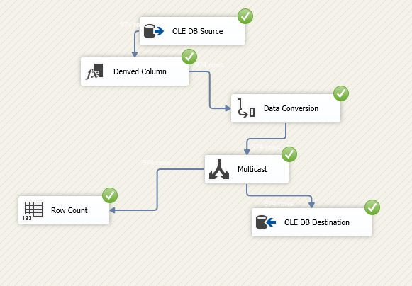

- **Customer Package**  
  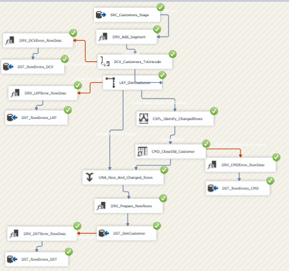

- **Product Package**  
  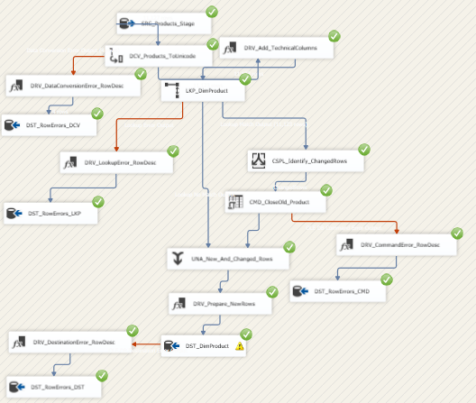

- **Fact Package**  
  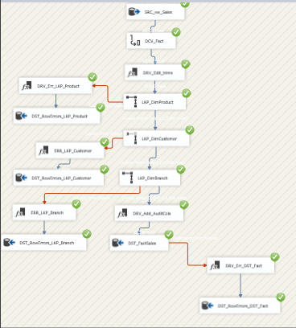

- **Dimension Tables Control Flow**  
  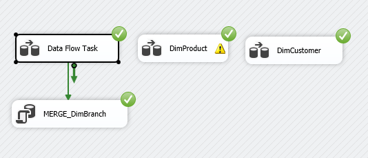

---

### 🔹 SSAS – Tabular Model & Measures
- **SSAS Tabular Screen**  
  

- **SSAS Measures**  
  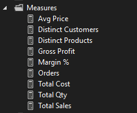

---

### 🔹 SSRS – Reports
- **Branch Report**  
  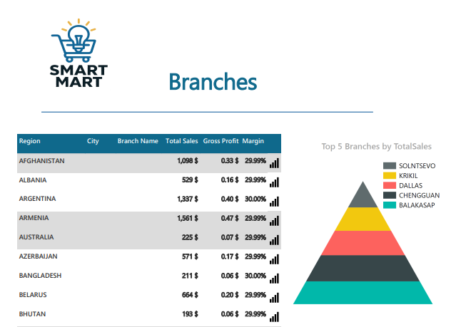

- **Customers Report**  
  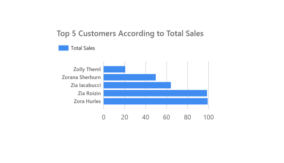

- **Products Report**  
  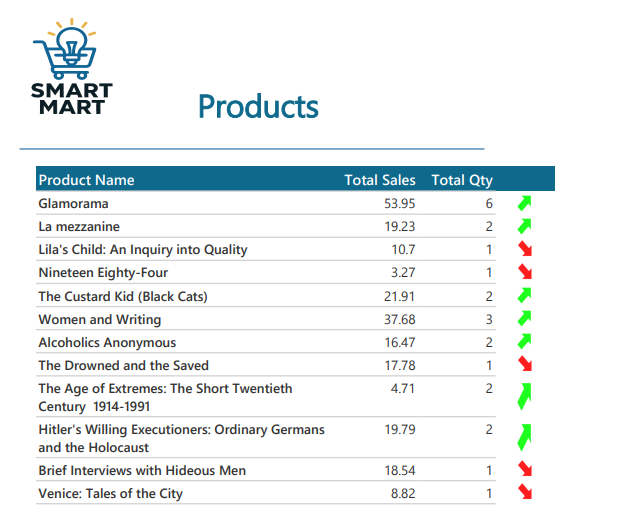

---

### 🔹 Power BI Dashboards
- **Smart Mart Dashboard – Screen 1**  
  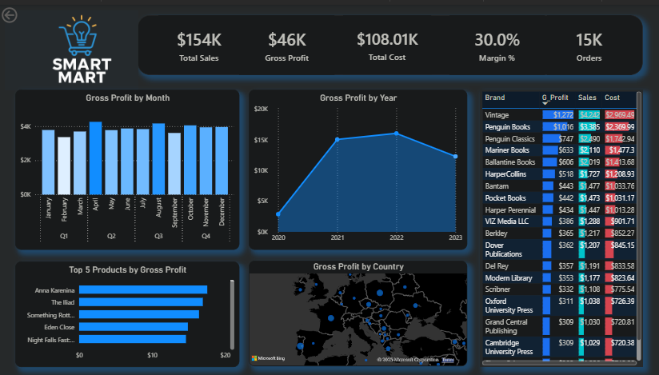

- **Smart Mart Dashboard – Screen 2**  
  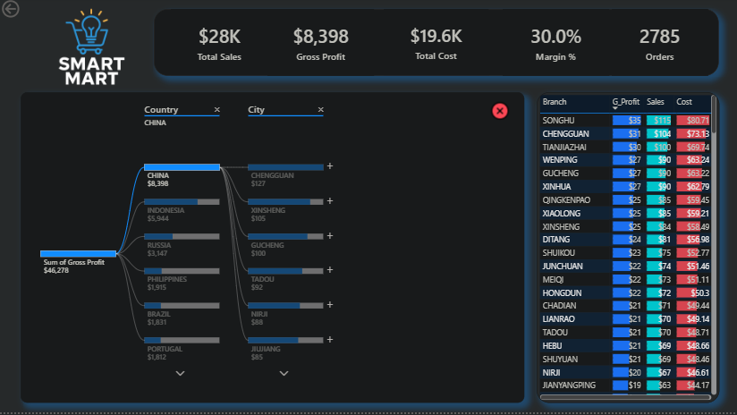

---

## 👤 Author

**Mahmooood**  
Data &Analytics Engineer  
SSIS | SSAS | SSRS | Power BI  
GitHub: https://github.com/MahmoooOod

---

## ✔ Project Status

🎉 **Project Fully Completed & Delivered**  

